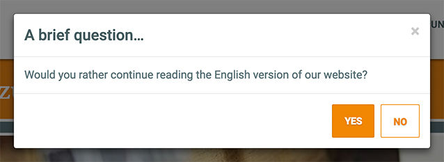

After the package is installed, some html is included at the start or the end of
the html body section. The position and the content of this html code can be changed via a system setting.

The rendered output can look like this:

## Chunks and placeholder

Two sample chunks are available that can be duplicated, renamed, and referenced in the system settings: `tplLangSuggestBar` and `tplLangSuggestModal`.

`tplLangSuggestModal` will display a Bootstrap 3 modal window and uses some jQuery code to set the cookie.
`tplLangSuggestBar` will display a Bootstrap 3 modal window, that is  

Both chunks use the following placeholder:

Key | Description
----|------------
cookie_expiration | The expiration of the cookie that will hide the modal after a selected display count.
cookie_name | The name of the cookie that will hide the modal after a selected display count.
cultureKey | The culture key of the first available browser accepted language.
current_id | The id of the current resource.
redirect_id | The id of the translated and Babel referenced resource with the first available browser accepted language.

## System Settings

The following MODX system settings are available:

Key | Description
----|------------
Chunk Position | The position of the LangSuggest chunk output in the body section of the rendered page. Could be set to 'top' and 'bottom'.
Cookie Expiration | The number of days the LangSuggest won't be visible, if it is closed by the button.
Cookie Name | The name of the cookie that is set by LangSuggest, when the language should be switched.
Debug | Log debug informations in MODX error log.
Display Count | Maximum display count of LangSuggest modal for each session, if a PHP session exist.
Modal Template | The template chunk containing the LangSuggest modal.
Sesssion-less Contexts | Show LangSuggest on session-less contexts.
